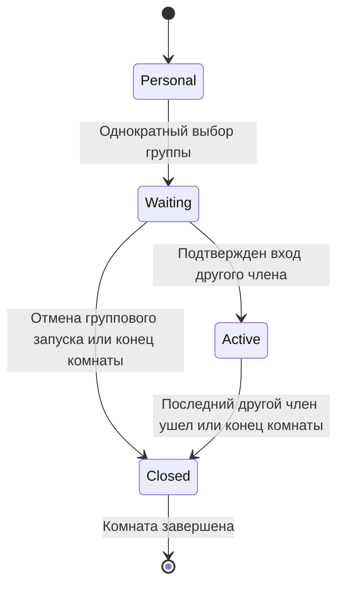

# Общая история группы — отложенная спецификация

Исходная дата: 2026-09-07. Редакция: 2. Статус изменен: 2026-09-08.

**Отложено; не реализовывать как текущий MVP.** Пользователь и кофаундер
выбрали одну личную историю каждого участника, доступную на его собственном
Plus/Pro. Группы остаются личными списками приглашения.

Текущий источник требований — [личная история и тарифы MVP](2026-09-08-personal-history-and-plans-mvp-design.md)
и [план реализации](../plans/2026-09-08-personal-history-and-plans-mvp.md).
Ниже сохранен прежний проект для контекста. Его общая точка группы, правила
последнего участника, переход к общему имени и перенос в Mine не входят
в текущую реализацию. Это не разрешение на развертывание.

## 1. Продуктовая модель и границы

У пользователя есть личная история. У постоянной группы есть отдельный
общий прогресс. Комната — временное место просмотра, которое может быть
связано ровно с одной группой. Следующая комната продолжает историю той
же группы, а не создает новую группу или новую карточку тайтла.

| Область | Что хранит и показывает |
| --- | --- |
| Mine / «Моя история» | Личный прогресс вне действующей групповой записи, ручные отметки и явно перенесенный результат группы |
| Together / «Вместе» | Общий прогресс групп, к которым у пользователя сейчас есть доступ |
| Комната | Текущий источник, синхронизацию, ведущего, присутствующих зрителей и состояние записи |
| Группа | Постоянный ID, создателя, название, состав и историю тайтлов |

Mine включает просмотр с гостями без группы. Поэтому в пояснениях
используется «Моя история», а не «Одиночная история». Существующие короткие
подписи переключателя Mine / Together сохраняются; отдельное переименование
навигации не требуется для запуска функционала.

Общий результат одинаков для всех текущих участников группы. Человек,
присоединившийся к группе после просмотра сезона, тоже видит этот сезон
просмотренным. Это состояние группы, а не утверждение о его личном просмотре.

В MVP входят:

- группы с общим названием и историей, доступной их участникам;
- запуск, приглашения, продолжение и присоединение через существующие комнаты;
- независимый прогресс одного тайтла у разных групп;
- личный прогресс гостей и просмотров без группы;
- окончательное завершение групповой записи после ухода последнего другого
  участника выбранной группы из конкретной комнаты;
- ручные отметки, сброс и разовый перенос прогресса на сайте;
- согласованные протокол, сервер, Worker, расширение и сайт;
- совместимость с существующей личной историей и проверяемая приемка.

За пределами MVP: передача ведущего, запуск группы обычным участником,
модераторы, платные роли управления, автоматические компании без группы,
постоянная синхронизация Mine с группой, учет пропусков внутри видео,
система встреч по датам, групповой чат и новая система приглашений.

## 2. Группа, членство и права

### 2.1. Создание и состав

1. Пользователь создает группу и становится ее неизменным владельцем.
2. Владелец добавляет подтвержденных друзей через существующее управление
   составом. Отдельного принятия членства в группе в MVP нет.
3. После добавления человек видит общее название и доступную историю группы.
   В форме создания/добавления ясно указано, что группа общая.
4. Только владелец приглашает новых членов и удаляет их. Участник может
   самостоятельно выйти из группы.
5. Группа из двух человек работает так же, как группа из нескольких.
6. Имена, порядок людей, переименование и изменение состава не меняют ID
   группы и не создают новую историю.

Вход в комнату по ссылке не создает дружбу или членство. Для добавления
такого гостя в постоянную группу сначала применяется существующий путь
дружбы, затем добавление владельцем.

Член группы, пришедший по обычной ссылке, учитывается как член группы.
Друг вне выбранной группы, приглашенный персонально, учитывается как гость.
Определяющим является членство, а не способ приглашения.

### 2.2. Матрица прав

| Действие | Владелец группы | Участник группы | Гость вне группы |
| --- | --- | --- | --- |
| Читать общее название, состав и прогресс | Да | Да | Нет |
| Создать комнату для этой группы | Да | Нет | Нет |
| Управлять общим play/pause/seek и источником | Да, как ведущий | Нет | Нет |
| Войти в действующую комнату | По действующим правилам комнаты | По действующему допуску | По действующему допуску |
| Приглашать в комнату от имени ведущего | Да | Нет | Нет |
| Менять состав или архивировать группу | Да | Нет | Нет |
| Редактировать общий прогресс | Да | Нет | Нет |
| Перенести результат группы в свою историю | Да | Да | Нет |
| Редактировать свою личную историю | Да | Да | Да |

Доступ к группе сам по себе не является пропуском в любую активную комнату.
При входе сохраняются проверки приглашения/ссылки, аккаунта, источника,
вместимости и одной активной комнаты на аккаунт.

### 2.3. Изменение состава

Добавление действует с подтвержденного сервером момента. Оно открывает
текущий общий результат, но не переносит в него прежние личные просмотры
человека. Уже сохраненная личная история остается личной.

Удаление, самостоятельный выход или прекращение дружбы с владельцем
отзывают членство и дальнейший доступ. Общий результат остальных не
сбрасывается. Если человек остается в комнате по действующему допуску,
он становится гостем для трекинга. Удаление из группы и удаление из комнаты
— разные действия; блокировки по-прежнему применяют существующие правила.

Если это был последний другой член группы в комнате, ее групповая запись
завершается. Повторное добавление или возвращение в группу не возобновляют
завершенную запись старой комнаты.

Повторное вступление открывает актуальный общий результат. Перенесенные
ранее личные отметки не удаляются ни при выходе, ни при повторном вступлении.

## 3. Создание комнаты и приглашения

### 3.1. Основной путь из плеера

Сохраняется пользовательский порядок: создать группу, добавить друзей,
открыть поддерживаемое видео, создать комнату через существующий Web flow,
затем пригласить группу из шторки пилюли.

1. Новая обычная комната первоначально не связана с группой.
2. Первое действие приглашения группы может одновременно закрепить эту
   группу для истории. До нажатия это явно видно в действии
   `Invite & track group`; связь не выводится позднее из списка получателей.
3. Владелец также может выбрать группу для записи без адресной рассылки
   и затем использовать существующую кнопку Copy invite. Это тот же
   механизм привязки, а не отдельный тип комнаты.
4. Сервер проверяет владельца комнаты и группы, состояние группы и
   отсутствие прежней групповой привязки этой комнаты.
5. После подтверждения владелец и члены группы видят компактную строку
   `Group progress: <name>`. Гостю показывается его личное назначение истории
   без раскрытия имени чужой группы. С этого момента группа закреплена
   за комнатой и не меняется.
6. Приглашения отправляются существующими действиями Friends & groups
   и Copy invite. Новый мастер получателей в истории не создается.
7. Можно ждать всех либо начать с одним другим членом группы. Остальные
   присоединяются обычным путем к текущему источнику и позиции.

Привязка допускается один раз за жизнь комнаты. Просмотр, записанный до
нее лично, не становится групповым задним числом. Это уточнение сохраняет
существующий порядок «сначала комната, затем приглашение группы» и заменяет
прежнюю рекомендацию обязательно выбирать группу до создания комнаты.

Если в момент привязки нужный член группы уже присутствует, сеанс начинается
после серверного подтверждения привязки и присутствия. Приглашение еще раз
того же человека для этого не требуется.

### 3.2. Дополнительные приглашения

После закрепления группы А любые новые приглашения только добавляют
получателей. Приглашение группы Б не переключает запись на Б и не создает
второй общий результат. Люди из Б учитываются для А только в том случае,
если они также являются действующими членами А.

В группе А может присутствовать несколько гостей по ссылке. Они не
поддерживают ее запись после ухода последнего другого члена А.

Отправленное или принятое приглашение не означает вход в плеер.
Отказ, отсутствие ответа, переполненная комната или невозможность открыть
видео не засчитываются как участие в просмотре.

Адресаты получают существующее приглашение в Inbox; системный показ
зависит от разрешений, настроек и действующих возможностей отправителя.
Отсутствие системного уведомления не удаляет приглашение. Повторная
попытка не создает дубликаты приглашений и уведомлений.

Снимок адресатов фиксируется при отправке. Добавленный позже член группы
не считается уже приглашенным: владелец приглашает его отдельно или
передает действующую ссылку. Новая рассылка не выполняется автоматически
при чтении истории или изменении состава.

Ошибка рассылки не откатывает уже подтвержденную связь комнаты с группой
и не создает новую комнату при повторе. UI отдельно отражает результат
привязки и отправки приглашений.

## 4. Жизненный цикл групповой записи

У комнаты сохраняются ее существующие состояния. Дополнительно у нее есть
отдельное состояние групповой записи, которое не заменяет room lifecycle.

| Состояние | Значение и переход |
| --- | --- |
| Без группы | Общая запись не выбрана; каждый пишет личное. Возможна одна явная привязка группы |
| Ожидание | Группа закреплена, но ни один другой действующий член еще не подтвердил вход |
| Действует | Подтвержден вход хотя бы одного другого действующего члена; запись идет по правилам раздела 5 |
| Завершена | Последний другой член подтвердил уход, истекло восстановление либо запись завершена владельцем; повторное открытие в этой комнате запрещено |

`Closed` запрещает запись в группу, но обычная комната может продолжать
существовать с личной историей. Возврата из `Closed` в `Waiting`/`Active`
в этой комнате нет. Перезапуск Worker, повтор запроса, новая вкладка,
другая серия или переименование группы не обходят это ограничение.

### 4.1. Ожидание и начало

Из Together источник открывается на общей точке и на паузе. При привязке
из плеера общая точка предлагается до совместного старта; хост может
осознанно оставить текущую серию/позицию. Предыдущие серии от такого
выбора просмотренными не становятся.

До первого другого участника общий результат не движется. Если хост
сам запускает видео в ожидании, его просмотр личный. Гости вне группы
также пишут личное.

Срок сеанса начинается по входу, а прогресс — по воспроизведению хоста.
Если первый член группы вошел и явно вышел еще до Play, запись завершается
без нового прогресса. Для следующего группового запуска нужна новая комната.

### 4.2. Уходы

Если кто-то ушел, но с владельцем остается хотя бы один другой член
выбранной группы, сеанс продолжается. Достаточно одного; присутствие
всех приглашенных, большинства или голосование не нужны.

После подтвержденного ухода последнего другого члена общая точка
фиксируется. Дальнейшее видео владельца и оставшихся гостей записывается
лично. Ушедшему ничего не дописывается от просмотра остальных.

Если ушедший сам продолжает видео после выхода из комнаты, это его личный
просмотр. Выход из комнаты не равен выходу из постоянной группы: общий
результат ему по-прежнему доступен во Together.

Возвращение в старую комнату после завершения групповой записи дает
обычный просмотр с личной историей. Для продолжения группы владелец
завершает старую комнату, если она еще активна, и создает новую той же группы.
Старая ссылка не переводит гостей в новую комнату автоматически.

Владелец завершил комнату или подтвердил свой уход — комната и групповая
запись завершаются для всех. Другой ведущий автоматически не назначается.

### 4.3. Обрывы связи и порядок

Явный выход и намеренное закрытие вкладки используют существующий
подтвержденный departure. Reload, BFCache и технический обрыв используют
существующий `ROOM_DISCONNECT_GRACE_MS = 60_000`.

На время восстановления последнего другого члена общая запись не
объявляется завершенной. Новые позиции хоста временно ожидают решения:

- восстановился в пределах grace — продолжается тот же групповой сеанс,
  ожидающие позиции относятся к нему по упрощенной модели достигнутой позиции;
- отсутствие подтвердилось — граница завершения соответствует утрате
  последнего подтвержденного присутствия, позиции оставшихся после этой
  границы относятся к их личной истории;
- явный выход — ожидания grace нет.

Если до окончательного подтверждения ухода вошел другой действующий член,
сеанс сохраняется: в комнате снова есть необходимый участник. Вход после
окончательного закрытия уже не возобновляет запись.

Ожидающие позиции не нужно сначала показывать в Mine, а затем удалять
при восстановлении. Сохраняется ограниченная очередь последних и
завершающих позиций по затронутым эпизодам. Завершенная запись не открывается
запоздавшими данными. При восстановлении самого хоста применяются те же
серверные границы и существующее завершение комнаты при истечении grace.

Порядок входа нового члена, удаления из группы и выхода прежнего последнего
определяет сервер. Если новый член уже подтвержден до ухода последнего,
сеанс продолжается. Если последнего уже признали ушедшим, новый вход
не открывает завершенный сеанс. Клиентские часы и порядок аватаров не
являются основанием решения.

Пауза, реклама, буферизация, выключенная камера и отсутствие микрофона
не являются уходом. Hibernation Worker при живых подключениях не завершает
сеанс и не сбрасывает его состояние.

## 5. Правила трекинга MVP

### 5.1. Куда записывается позиция

| Ситуация | Владелец/участники группы | Гость вне группы |
| --- | --- | --- |
| Просмотр без комнаты | Собственное Mine | Собственное Mine |
| Комната без выбранной группы | Mine каждого зрителя | Mine каждого зрителя |
| Группа выбрана, первый другой член еще не пришел | Mine тех, кто реально запустил свое видео | Собственное Mine |
| Групповой сеанс действует | Общая история выбранной группы; автоматической копии в Mine нет | Собственное Mine |
| Пауза/реклама/буферизация после начала сеанса | Назначение истории сохраняется; личных вкраплений не возникает | Собственное Mine по своему плееру |
| Групповая запись этой комнаты завершена | Собственное Mine дальнейшего просмотра | Собственное Mine |

При действующем групповом сеансе общую позицию дает ведущий. Нужны:

1. подтвержденная связь комнаты с этой группой;
2. действующий владелец в роли ведущего;
3. хотя бы один другой текущий член группы, вошедший в комнату на странице
   плеера, а не только принявший приглашение;
4. валидная позиция поддерживаемого видео хоста и разрешенная запись источника;
5. незавершенный групповой сеанс и актуальные серверные полномочия.

Два устройства одного аккаунта не считаются двумя зрителями.

Для MVP достаточно присутствия члена группы в действующем синхронном
просмотре. Не собираем поминутные доказательства того, что каждый участник
воспроизводил каждый участок видео. Его локальная буферизация или реклама
не превращает общее состояние в личное и не меняет членство.

Общий прогресс следует фактической позиции хоста. Пауза/реклама/буферизация
самого хоста не продвигают его. Камера, микрофон и медиаместо не определяют,
смотрит ли человек исходное видео. P2P-статистика не используется для записи
прогресса сериала.

Назначение определяется контекстом конкретного плеера. Самостоятельное
видео в другой вкладке не становится групповым только из-за того, что
этот аккаунт также находится в групповой комнате. Другой источник не
может использовать ее полномочия для изменения общего прогресса.

### 5.2. Достигнутая позиция вместо просмотренных отрезков

Для одной серии или фильма сохраняются:

- `maxReachedPosition` — самая дальняя принятая позиция в совместимой версии
  видео, начиная с последнего явного сброса;
- `resumePosition` — позиция последнего принятого продолжения, с его порядком;
- `completed` — сохраненная отметка завершения.

Пример: гость вошел на 12-й минуте пятой серии и вышел на 18-й. В Mine
сохраняется 18 минут прогресса этой серии. Начало 0–12 отдельно не проверяется.
Прежние четыре серии автоматически не отмечаются.

Тот же принцип применяется к группе: если она начала с середины и дошла
до 18-й минуты, ее прогресс серии — 18 минут. Количество зрителей и смена
состава не умножают результат.

Новый автоматический прогресс появляется после подтвержденного начала
воспроизведения видео. Простое открытие тайтла, принятие приглашения,
подготовка общей точки на паузе или hover карточки ничего не засчитывают.
После начала просмотра сохраняются осмысленные контрольные точки:
пауза, остановка/выход, смена источника, конец видео и текущий heartbeat.

Перемотка вперед с последующим воспроизведением увеличивает достигнутую
позицию; пропущенное начало этой серии не вычисляется. Перемотка назад
не уменьшает `maxReachedPosition` и не снимает `completed`, но после нового
воспроизведения может изменить `resumePosition` для удобного пересмотра.
Переход/подготовка другой серии без воспроизведения не делает ее просмотренной.

`maxReachedPosition = max(старое значение, новая допустимая позиция)`
применяется только внутри одного эпизода, владельца истории и совместимой
временной шкалы. Максимум по номерам серий или позициям разных тайтлов
не имеет смысла. Явный сброс/ручная замена могут уменьшить результат.

### 5.3. Завершение, проценты и продолжение

Сохраняется действующее правило проекта: валидное событие конца видео
`ended` либо достигнутая позиция не меньше 90% достоверной длительности
устанавливают `completed`. Теперь это правило одинаково для личной и
групповой записи, без проверки покрытия просмотренными отрезками.

При неизвестной длительности процент не показывается; валидный конец
видео может завершить выпуск. Ручная отметка также может его завершить.
Отсутствие длительности не дает права рисовать произвольные 100%.

Попадание ближе к концу с последующим воспроизведением может завершить
серию, даже если пользователь не видел начало. Это принятое упрощение MVP.
Старые завершенные серии не снимаются при обычном пересмотре.

Отметка по 90% не означает фактический конец видео: до `ended` кнопка
продолжения ведет на сохраненную позицию, чтобы можно было досмотреть остаток.
После `ended` предлагается следующий известный вышедший основной выпуск
по каталогу. Предыдущие пропуски не заполняются. Specials не вставляются
в очередь автоматически. Закончившийся фильм предлагает `Rewatch`.
Если следующего выпуска нет или каталог неполон, следующий номер не выдумывается.

У серии шкала достигнутого прогресса основана на ее позиции/длительности.
Счетчик сезона и сериала основан на числе завершенных основных серий:
`completedEpisodes / availableEpisodes`. Частичная серия не добавляет целую
единицу. Specials имеют отдельный счетчик. При неизвестном полном каталоге
показывается число известных завершенных серий без ложного знаменателя.

Это отметки прогресса, а не статистика фактически просмотренных минут.
Нельзя считать время просмотра как сумму достигнутых позиций, умножать
ее на людей или использовать для списания тарифных минут комнаты.

### 5.4. История гостя и отсутствие группы

У гостя вне группы в Together не появляется новая запись от этой комнаты.
У него есть одна личная карточка тайтла в Mine, со своим достигнутым
прогрессом и продолжением. Его доступ к другим собственным группам не меняется.

Если несколько людей смотрят вообще без группы, у каждого обновляется
личная история. Ранний уход фиксирует его собственную последнюю позицию;
поздний вход не ограничивает результат только минутами после входа.
Просмотр остальных после его ухода ничего ему не дописывает.

Без группы нет общей сохраненной точки для следующего вечера. Продолжение
из Mine использует личную точку пользователя; приглашения снова выполняются
из пилюли. Для постоянной общей точки создается группа, в том числе для двоих.

### 5.5. Обязательный сквозной пример

Группа: владелец, Аня и Игорь. Дима — гость по ссылке вне группы.

| Событие | Общая история группы | Личная история |
| --- | --- | --- |
| Аня ушла, владелец остался с Игорем и Димой | Продолжает двигаться по владельцу | У Димы собственный просмотр; участникам группы он автоматически не копируется |
| Игорь ушел на S1 E5 18:00 | Запись этой комнаты завершена на E5 18:00 | Начинается личная запись дальнейшего просмотра владельца |
| Владелец с Димой дошел до E6 10:00 | По-прежнему E5 18:00 | У обоих собственная E6 10:00 |
| Игорь вернулся по старой ссылке | По-прежнему E5 18:00, запись не возобновляется | Его дальнейший просмотр в этой комнате личный |
| Владелец создал новую комнату той же группы | Старт с E5 18:00, затем новый групповой сеанс | Старые личные результаты не переписываются |
| В группу добавили нового друга | Он видит актуальный общий результат целиком | В его Mine он не копируется автоматически |

## 6. Интерфейс Together

### 6.1. Карточка тайтла и группы

Один канонический тайтл внутри ресурса — одна карточка. Разные группы
находятся в выпадающем списке внутри нее. Новые дни, комнаты, ранние уходы
и новые люди не создают дополнительные карточки.

Сохраняется существующий дизайн: увеличенные логотипы ресурсов, аккуратные
оранжевые счетчики, тонкая рамка всего тайтла, мягкая подложка раскрытой
части, ivory-контролы, сдержанный оранжевый акцент и перенос длинного
названия по верхней линии обложки. Даты на карточки не возвращаются.

В свернутой карточке видно название выбранной группы, ее краткую точку
и общий счетчик тайтла. При раскрытии:

1. выбор группы;
2. выбор сезона/Specials и счетчик сезона;
3. сетка выпусков;
4. одна стабильная панель выбранного выпуска с временем и действием.

Селектор групп использует тот же визуальный компонент, что сезоны.
Пункт содержит название, компактные аватары и общую точку. При одной
доступной группе показывается ее название без ложного выпадающего меню.
Если названия совпадают, различие дает имя создателя, а не новый ID просмотра.

Первый выбор — последняя использованная доступная группа для этого тайтла;
иначе последняя по общей активности, затем стабильный ID при равенстве.
Выбор запоминается по аккаунту и тайтлу; серия/сезон/scroll — по группе и сезону.
Переключение группы ничего не запускает и никого не приглашает.

Аватары с подписью `Group members` раскрывают текущий состав по нажатию,
доступному также с клавиатуры. Не называем всех этих людей «смотревшими»
каждую серию. Отдельный пользовательский журнал посещений в MVP не вводится.

### 6.2. Сетка и панель прогресса

Сохраняются шесть колонок, пять на узкой ширине и максимум четыре-пять
видимых рядов по высоте шторки. Остальные серии прокручиваются внутри.
Полосы прокрутки появляются при взаимодействии и исчезают без изменения
ширины контента. Переключение сезона и Mine/Together не вызывает мигания
пустой разметки, сдвига всей шторки или подстановки чужих данных.

У плитки выпуска четыре независимых признака: нет прогресса, есть
достигнутый прогресс, завершен, выбран. Галочка показывает `completed`,
нижняя шкала — достигнутую позицию, оранжевая рамка — текущий выбор.

Панель под сеткой показывает заголовок и место продолжения выбранной
серии с соответствующей ему шкалой времени. При пересмотре это место
может быть раньше достигнутого прогресса на плитке. Кнопка должна вести
именно на показанную точку, а не на скрытый максимум.

Высота/сетка зон времени и кнопки стабильны; длинный заголовок переносится.
Смена сезона или обновление данных не подменяют явно выбранную серию
последней просмотренной. Данные другой группы не отображаются под новым
названием даже на время загрузки.

Specials определяются явными метками принятого каталога. E0, дробный номер
или season 0 сами по себе не означают специальный выпуск. Они используют
отдельный пункт селектора и собственные названия/счетчики. Фильм и одиночное
видео показывают одну панель прогресса на той же подложке, без выдуманного сезона.

Личные проценты, предупреждения «ты отстал», отметки времени входа/выхода,
фильтровые чипы под панелью и список встреч по датам не добавляются.

### 6.3. Поиск, фильтры и состояния

Поиск, фильтр ресурса и доступные даты применяются к доступной групповой
истории до пагинации. Фильтр участника, если показан, означает текущего
члена группы и так подписан; он не утверждает фактическое совместное
присутствие. Старые личные фильтры не переносятся в Together с другим смыслом
без явного преобразования или сброса.

Фильтры не пересчитывают сохраненный общий прогресс. Дата фильтрует
активность тайтлов, а не делает временную копию счетчика. Будущие даты
недоступны; существующий компактный popover календаря сохраняется.

Различаются состояния: нет групп, в группах еще ничего не смотрели,
ничего не найдено, доступ потерян, источник недоступен и ошибка загрузки.
Для отсутствия групп достаточно короткой подсказки:
`Shared progress is saved in groups. Watching without a group is saved in Mine.`
Уже существующая группа без прогресса видна в People/Groups; пустые
тайтлы не создаются от одного отправленного приглашения.

Loading/error не рисуют 0% вместо последнего подтвержденного результата.
Кеш привязан к аккаунту, группе и версии доступа; offline помечается как
сохраненное состояние. Из кеша нельзя выдать свежие права или запустить комнату.

Все контролы доступны с клавиатуры, имеют focus-состояние и понятное имя.
Анимации учитывают reduced motion; важные действия доступны без hover.

## 7. Продолжение и смена источника

### 7.1. Владелец продолжает группу

1. Раскрывает тайтл, выбирает группу и нажимает `Resume` у показанного выпуска.
2. Сервер проверяет доступ, группу, актуальную ревизию, источник, тарифные
   ограничения комнаты и собственную активную комнату пользователя.
3. Если уже действует подходящая комната этой группы, возвращает в нее
   без создания второй и без неожиданного seek для ее зрителей.
4. Иначе создает новую комнату с той же группой и выбранным источником.
   Открытие правильного видео и установка позиции подтверждаются расширением;
   сначала видео остается на паузе.
5. Открывается существующая шторка приглашений. Автоматической рассылки
   прежнему составу от кнопки Resume нет.
6. После входа другого члена и воспроизведения начинается запись нового сеанса.

Иная активная комната не закрывается молча. Пользователь завершает ее
через существующее управление и повторяет запуск. Комната с завершенной
групповой записью не считается подходящей для продолжения группы.

Если комната этой группы уже действует с другим тайтлом/выпуском,
показывается ее фактический источник и действие возврата в комнату.
Новая комната или скрытая смена видео от старой карточки не выполняются;
сменить источник владелец может через существующее управление плеером.

Если пользователь намеренно выбрал другую серию, действие подписано
`Watch episode`/`Rewatch`, а не обещает прежнюю общую точку. В уже идущей
комнате переход выполняет владелец через обычное управление источником.
Чтение/выбор карточки не перематывает комнату.

### 7.2. Участник и гость

У участника есть `Join`, когда доступна разрешенная действующая комната.
Когда владелец ее не запустил, UI сообщает это и не предлагает создать
комнату от его имени. Группа может иметь активную комнату с другим тайтлом:
статус показывает фактический источник; нельзя обещать запуск старого тайтла.

Гость продолжает собственное видео из Mine. Для новой встречи использует
обычную комнату и приглашения. У него нет действия запуска чужой группы.

### 7.3. Надежность запуска и каталог

Повторный клик, сетевой повтор или потерянный ответ возвращают результат
той же операции запуска. Они не создают вторую комнату, группу или рассылку.
Состояние незавершенной операции можно прочитать по ее ID.

Сохраненная ссылка не применяется к произвольному видео. Проверяются
канонический выпуск, provider, поколение источника и совместимость версии.
Если источник удален, регионально недоступен или каталог не подтверждает
соответствие, UI сообщает причину и предлагает допустимый выбор источника
без выдуманного пересчета секунд.

Смена серии/сезона/тайтла в действующей комнате сохраняет выбранную группу
и состояние сеанса. Прогресс относится к каноническому тайтлу нового источника.
Смена provider подчиняется существующему ограничению комнаты и при
необходимости требует новую комнату. Данные прежнего источника не попадают
в новый из-за одинакового отображаемого номера серии.

Если групповая запись уже завершена, переключение серии ее не возобновляет.

## 8. Редактор истории на сайте

Один редактор обслуживает «Мою историю» и собственные группы. Текущий
владелец результата всегда указан до применения операции. Обычный участник
не может редактировать группу, но может перенести ее результат себе.

Редактор позволяет:

- найти поддерживаемый тайтл, который еще не записывался AniDachi;
- отметить/снять просмотренность одной серии, выбранных серий или сезона;
- работать со Specials и фильмами по их реальным ID;
- задать частичную позицию и отдельно место продолжения;
- очистить серию, тайтл или всю историю выбранного владельца;
- перенести прогресс из доступной группы в Mine.

Отметка сезона относится к показанному набору выпусков. Новая серия,
вышедшая после операции, не становится просмотренной автоматически.
При неполном каталоге массовое действие явно относится только к известным
выпускам. Нет глобального поиска произвольных названий без каталога/ID:
для поддерживаемого источника используется канонический поиск или ссылка.

Для просмотренного до регистрации дата необязательна. Не присваивать ему
сегодняшнюю дату просмотра; время правки хранится отдельно. Ручные отметки
не создают фиктивные комнаты, присутствие и просмотренные минуты.

`Mark unwatched` очищает завершенность и достигнутый прогресс выбранного
выпуска. Задание частичной позиции — отдельное действие. Если очищенный
выпуск был точкой продолжения, она сбрасывается на его начало; удаление
всего тайтла удаляет и его точку. Правка другой серии не заменяет курсор.

Ручная правка результата, который сейчас автоматически записывается,
в MVP требует остановить соответствующий просмотр. Она не перематывает
чужие плееры. Проверка выполняется на сервере, включая еще не завершенную
операцию запуска. Просмотр других тайтлов не блокирует правку выбранного.

Удаление/уменьшение показывают точную область и последствия до подтверждения.
Личная очистка не затрагивает группы. Очистка группы не стирает Mine участников.
Снятие отметки имеет приоритет перед более старыми автоматическими данными.
Новый осознанный просмотр после сброса может снова накапливать прогресс.

## 9. Разовый перенос группы в Mine

Путь: сайт → история → `Import group progress` → группа → тайтл →
предварительный результат → подтверждение. Вход из меню тайтла подставляет
выбранные группу и тайтл. Настройки ведут в этот же экран, без второго редактора.

1. По умолчанию добавляются недостающие завершенные серии и более дальний
   совместимый частичный прогресс. Личные отметки не удаляются.
2. Если лично завершены E1–E10, а в группе E1–E6, личные E7–E10 сохраняются.
3. Существующее личное место продолжения сохраняется. Отдельным явным
   выбором можно взять точку группы. При пустой личной истории она предлагается сразу.
4. Для точного совпадения есть отдельная операция `Replace this title`.
   Предварительный результат показывает также снимаемые отметки.
5. Копируются конкретные выпуски. Наличие E1, E2 и E5 не заполняет E3/E4.
6. Другие тайтлы и исходная группа не изменяются.
7. Член группы вправе перенести результат, который лично не смотрел.
8. Перенос не копирует даты/минуты чужого просмотра и сведения о присутствии.
9. После переноса связи нет: дальнейшие просмотры/правки группы и выход
   пользователя из нее не меняют уже сохраненный личный результат.

Подтверждение проверяет версии источника и личного результата, показанные
в предварительном просмотре. Если любая из них изменилась, доступ потерян
или источник удален, требуется обновить предварительный результат.
Незаметно копировать более новый сезон запрещено. Это простая проверка
версий, без отдельного хранилища долгоживущих снимков импорта.

Операция применяется целиком и имеет постоянный ID для повторов. Сетевой
повтор не выполняет перенос второй раз. Новый намеренный перенос допустим
с новым предварительным результатом; ранее снятая отметка не возвращается
автоматически без такого действия.

## 10. Владельцы данных и минимальный контракт

### 10.1. Существующие плоскости

| Плоскость | Ответственность |
| --- | --- |
| Web + Supabase | Постоянные группы/членство, права, личный и общий результат, операции редактирования и импорта |
| Worker / Room Durable Object | Подтвержденное присутствие, порядок, источник, активная групповая привязка и окончательное закрытие записи |
| Extension background | Единственный писатель расширения: собственные наблюдения, локальное сохранение, очередь и согласование кешей |
| Extension UI и сайт | Представление, выбор, запуск и команды; не определяют самостоятельно права или владельца прогресса |
| packages/protocol | Версионированные схемы состояний, контрольных точек, команд, ответов и ошибок |

Новый сервис комнат, приглашений или синхронизации не создается. Постоянный
результат группы хранится один раз на сервере; не копируется во все аккаунты.

### 10.2. Постоянные данные

Имена ниже описывают контракт; SQL-имена следуют конвенциям репозитория.

| Сущность | Обязательные данные и ограничения |
| --- | --- |
| Group | Стабильный ID, ownerUserId, общее отображаемое имя, active/archived, версия; связь с существующим списком друзей |
| GroupMembership | groupId/userId, действительность членства и версия; добавление/удаление не затирают границы, нужные для ожидающих контрольных точек |
| RoomGroupSession | roomId/roomGeneration, groupId, уникальный groupSessionId, server ordinal, waiting/active/closed, границы начала/конца, причина, версия; не более одной привязки за жизнь комнаты |
| EpisodeProgress | Владелец user/group, provider/title/episode ID, совместимая версия видео, maxReachedPosition, resumePosition/order, duration, completed, основание auto/manual/import, версия и граница сброса |
| TitleResume | Владелец истории, тайтл, выбранный выпуск, позиция/источник, порядок; отдельно от множества завершенных серий |
| MutationReceipt | ID операции, инициатор, область, хеш запроса, результат/состояние для безопасного повтора |

Уникальность общего результата: `groupId + provider + canonicalTitleId`,
а выпуска внутри него — по каноническому episode ID. Фильм остается
самостоятельным тайтлом. Текстовое название и номер сезона не являются ID.

Членство в группе и присутствие в комнате — разные данные. Для защиты
порядка нужны границы участия и версии, но не история просмотренных
отрезков, не журнал встреч для пользователя и не процент просмотра каждого
участника группы.

Уникальность групповой привязки проверяется по `roomId`, а не только по
паре `roomId + roomGeneration`. Новое поколение существующей комнаты
не разрешает вторую привязку или открытие завершенной групповой записи.

### 10.3. Контрольная точка и принятие

Новая версия контрольной точки содержит собственный account/session scope,
ID события, канонический источник, текущую и максимальную позиции,
длительность, признак конца, локальную последовательность и подтвержденный
контекст комнаты/группового сеанса, когда он есть.

В обычном просмотре пользователь отправляет только собственную позицию.
При групповой записи общую позицию предлагает ведущий; сервер проверяет
его роль и состояние сеанса. Гость не может записать себе позицию хоста
из UI или обновить группу от своего имени.

Существующая room-history attestation подтверждает допуск при выдаче;
сама по себе она не доказывает, что групповая запись еще действует.
Новый контракт связывает контрольную точку с groupSessionId, поколением
комнаты/источника и порядком, подтвержденным Worker. Web проверяет
окончательные границы по постоянному состоянию, а не только подпись/срок токена.

Worker и Web расширяют существующий надежный lifecycle-контракт:
подтвержденные привязки, изменения членства, departure, source changes и
закрытие имеют общий порядок, подтверждение доставки и повтор. Изменение
состава в Web нельзя задержанно применять в Worker как разрешение считать
уже удаленного человека участником. Неопределенное состояние временно
ожидает подтверждения и не записывается как заведомо личное или групповое.

Одна транзакция принятия проверяет ID/повтор, владельца, поколения,
источник, границу сброса и границы группового сеанса, затем обновляет
соответствующий результат и ревизию. Частичного переноса между Mine и
группой быть не должно. UI не выбирает назначение по текущей вкладке.

### 10.4. Порядок, повторы и сброс

Для общей точки порядок задается серверным номером сеанса, поколением
источника и последовательностью ведущего. Поздняя точка старой комнаты
может увеличить допустимый достигнутый прогресс ее выпуска, но не
переставляет место продолжения более новой комнаты.

Данные периода группового просмотра не превращаются в личные только
потому, что пришли после закрытия комнаты. Позиции после окончательной
границы не могут дописать группу. Клиентский timestamp не открывает
завершенный сеанс и не возвращает отозванный доступ.

Одинаковый ID события/команды применяется один раз. Версия результата
защищает от конкурентной правки, а граница сброса — от возвращения старого
прогресса. Это разные проверки. Сброс E2 не должен потерять ожидающие
данные E3 или сбросить другую группу с тем же тайтлом.

Чужой аккаунт, старая вкладка после takeover, устаревшее поколение источника
и неподходящая версия видео не принимаются как текущий писатель.

### 10.5. Очередь и ограничения размеров

Сохраняется текущий подход latest + terminal. Очередь хранит также
максимальную неподтвержденную позицию: последующий rewind не должен
стереть еще не отправленные 18 минут, заменив их на 4 минуты.

Ключ включает аккаунт, назначение истории, групповой сеанс при наличии,
поколение источника и эпизод. Переход из группы в личное не сливает две
разные очереди. Ack удаляет только подтвержденную версию; потерянный ответ
не означает повторное применение на сервере.

Используются существующие heartbeat и отправка на важных событиях, без
HTTP-запросов каждую секунду. Списки/каталог/селекторы имеют страницы не
больше 50 элементов и непрозрачные курсоры. Новые пакеты ограничены 64 KiB;
большие очереди отправляются несколькими пакетами без потери эпизодов.

Срок offline room-authority остается `ROOM_HISTORY_OFFLINE_GRACE_SECONDS =
86_400` от выдачи. Это срок доставки допустимых данных, а не разрешение
считать комнату действующей сутки. Окончательно отклоненные данные не
показываются как успешно сохраненные. Временная ошибка допускает повтор;
полная очередь/хранилище дают честное состояние ошибки.

## 11. Операции API и поведение при ошибках

Общие DTO имеют отдельный версионированный контракт Together. Существующий
`solo/shared` описывает тип комнаты/сеанса и не равен новому назначению
`personal/group`: просмотр нескольких людей без группы теперь личный.
Нельзя просто переименовать фильтр старого browse и считать функцию готовой.

| Операция | Обязательная семантика |
| --- | --- |
| List/read groups | Раздельно свои и группы участия; текущее членство, имя и разрешенные действия |
| Browse titles / read group title/catalog | Только доступные группы; общий результат выбранной группы, реальный каталог, cursor/version |
| Bind group to room | Владелец комнаты = владелец группы; один раз за комнату; идемпотентность; явная связь с отправкой первого группового приглашения |
| Prepare / launch / recover launch | Проверка перед созданием, одна операция, правильный source/paused position, без скрытого завершения другой комнаты |
| Capture/reconcile checkpoint | Собственное наблюдение, проверенное назначение personal/group, поколения/порядок, ack |
| Edit/reset progress | Только владелец результата, точная область, expected revision и новая граница для старых данных |
| Preview/apply import | Текущий доступ, версии источника и личной цели, merge/replace и отдельный выбор resume |
| Leave/archive group | Текущее членство/владелец, надежная инвалидация доступа и связи активной комнаты |

Join, приглашения, уведомления, квоты и callbacks Worker используют
существующие маршруты с согласованным расширением контрактов. Новый
namespace `/api/watch-history/v3/together` используется для общего чтения
и управления общим прогрессом; новый формат писателя не маскируется под
старый strict DTO v3. Точные схемы сначала фиксируются в packages/protocol
и сразу проверяются со всеми потребителями.

Ошибки различают: нет авторизации/доступа, группа архивирована, групповая
запись завершена, другая активная комната, конфликт версии, квота, источник
недоступен, требуется обновить расширение, временно нет authority и
данные не сохранены. Недоступный чужой ID не раскрывает существование
группы или ее состав. Ошибка не превращается в пустую историю, 0% или
успешный запуск.

## 12. Согласие, приватность, тарифы и удаление

### 12.1. Согласие и доступ

Сохраняется текущая политика поддерживаемых источников и согласия на
YouTube history. Привязка группы, приглашение, импорт и чтение истории
не включают автоматическую запись незаметно.

Групповую запись источника разрешает владелец, поскольку это его группа
и общий результат. Личная настройка гостя управляет его Mine. Присутствие
участника в комнате используется для жизненного цикла общей записи,
не создает его личную историю и не превращается в подробный журнал просмотра.
Если владельцу недоступна запись выбранного источника, группа остается
выбранной, но новое автоматическое сохранение приостановлено с понятной
причиной; нельзя незаметно писать этот просмотр в Mine вместо группы.

Новый член читает текущий общий результат. Он не получает чужую личную
историю, приватные списки владельца, почту, токены и подробные старые журналы.
Гость вне группы не получает общее название/историю в API, кеше или уведомлении.

Отзыв доступа блокирует новые серверные чтения и действия. Подключенный
клиент получает инвалидацию. Уже показанный offline-кеш нельзя обещать
мгновенно стереть без сети; он не выдает свежие права и удаляется при
следующем подтвержденном отзыве/выходе из аккаунта.

### 12.2. Тарифы и хранение

Числа тарифов этой функцией не меняются. В текущем коде лимит собственных
групп — Free 1, Plus 5, Pro 15; участие в чужой группе этот лимит не расходует.
Вместимость комнаты определяется тарифом ведущего, включая гостей вне группы.
Групповой прогресс не меняет существующий расчет оплачиваемых host-minutes.

Постоянный общий результат обслуживается по политике владельца группы.
Более низкий тариф читающего участника не обрезает ему общий счетчик или
часть сезона. Личная история и импорт остаются данными его собственного аккаунта.

В entitlements также объявлены 3/15/50 активных тайтлов и 7/92/366 дней
истории, используемые старой watch-library. Их наличие не является
разрешением в этом релизе вводить новую очистку Watch History v3 или общий
новый бюджет тайтлов. Сохраняется действующая политика хранения v3;
новая тарификация/срок удаления общей истории не входят в этот MVP.
Если такая политика вводится отдельно, она должна применяться к общему
результату по владельцу, а не по случайному участнику или сроку UI-кеша.

Очистка технических подтверждений после допустимого окна доставки не
удаляет накопленный результат. Нужные для отклонения старых данных
границы/версии сохраняются. Простое чтение, переименование или повтор
запроса не создают новую активность просмотра.

### 12.3. Архив, удаление и личные копии

Архивирование группы владельцем прекращает новые групповые запуски и
закрывает ее действующую групповую запись. Комната может продолжиться
лично. Состав и общий результат остаются доступными текущим членам
только для чтения и разового переноса; архив явно обозначен.

Удаление общего прогресса из редактора удаляет выбранную область у
группы для всех ее участников. Это не архивирование и не личная очистка.
Поздние контрольные точки не восстанавливают удаленное. Новый явный
просмотр после удаления может создать новый результат с новым поколением.

Удаление аккаунта владельца делает группу недоступной без передачи
управления. Сроки физического удаления подчиняются существующей политике
удаления аккаунта. Личные истории и ранее перенесенные результаты других
пользователей не удаляются вместе с ним.

## 13. Совместимость и миграция

1. Текущая личная история v3 сохраняется. Новые группы не вычисляются
   задним числом из старых shared-сессий, дат, списков людей или инвайтов.
2. Старый личный результат остается в Mine, включая ранее записанный
   совместный просмотр. Переносить его в группу или удалять из Mine нельзя.
3. Новая маршрутизация применяется к новым наблюдениям после включения
   согласованной версии. Глобального сброса истории для этой функции нет.
   Для старой строки начальное `maxReachedPosition` берется из сохраненной
   позиции, `resumePosition` и существующая завершенность сохраняются.
   Более дальнюю прошлую позицию, которой в старых данных нет, не выдумываем.
4. Существующие группы сейчас приватные списки владельца. Перед первым
   включением общей истории для такого списка владелец явно задает/подтверждает
   общее имя. Старое приватное название автоматически не публикуется.
5. Для новых групп общая видимость названа сразу. Состав переиспользуется
   по ID, без копирования отдельных групп по каждому тайтлу.
6. Для клиентов без нового tracking-контракта запуск/вход в комнату с
   групповой записью недоступны до обновления. Они не могут молча продолжать
   старую автоматическую запись всех shared-сессий в Mine.
7. Старые личные DTO/read остаются совместимыми. Общий кеш не заменяет
   личный; sign-out/account switch очищают только соответствующий scope.
8. Новый контракт контролирует все пути письма: новый endpoint, старый
   reconcile, очередь старого расширения, SQL/RPC и поздние callbacks.
   Старый писатель не получает обхода через прямую схему v3.
9. Переход по capability включается только после доставки согласованных
   DB, Web, Worker и расширения. Молчаливого отката к другому владельцу
   истории при несовпадении версий нет.

Порядок поставки: добавочные таблицы/ограничения → Web и протокол → Worker
с надежным lifecycle → совместимое расширение и сайт → включение capability
на staging → приемка → отдельное решение о production.

Откат закрывает новые групповые запуски и согласованно завершает действующие
групповые записи, сохраняя данные и совместимые reads. Старые неподходящие
писатели не включаются ради отката. База не откатывается разрушительным
удалением истории. Точный rollback фиксируется в PR поставки.

## 14. Приемочные сценарии

Каждый сценарий — требование к будущей реализации, а не отметка уже
прошедшего теста. Точные ожидаемые значения проверяются на уровне протокола,
БД/сервера и пользовательского пути, где это применимо.

| ID | Сценарий | Ожидаемый результат |
| --- | --- | --- |
| T01 | Создатель добавил подтвержденного друга | У друга есть общее имя/результат; отдельного принятия членства нет |
| T02 | Новый член пришел после завершенного сезона | Видит весь общий сезон; Mine автоматически не меняется |
| T03 | Два пользователя создали разные группы с тем же тайтлом | Независимые результаты и продолжение |
| T04 | Переименование/смена состава | Сохраняются ID и общий прогресс |
| T05 | Обычный участник пытается запустить/изменить группу | Отказ на сервере; скрытия кнопки недостаточно |
| T06 | Создана комната, затем впервые приглашена группа | Одна явная привязка; правильная группа видна в пилюле |
| T07 | До привязки уже смотрели лично | Старое личное не переносится в группу |
| T08 | Повтор привязки/двойной клик/потерянный ответ | Та же операция и связь; нет второй комнаты/рассылки |
| T09 | После А приглашена Б | Запись остается А; общая история Б не меняется |
| T10 | В выбранную группу пришли по ссылке | Текущее членство распознается независимо от способа входа |
| T11 | По ссылке пришел человек вне группы | Только его Mine; нет доступа к общей истории/имени |
| T12 | Несколько людей смотрят без группы | Личная карточка у каждого; новых компаний в Together нет |
| T13 | Отправили/приняли invite без входа в плеер | Участие/прогресс не возникают |
| T14 | Хост еще ждет первого члена | Общая точка стоит; его явный просмотр личный |
| T15 | Пришел один из пяти приглашенных членов | Достаточно для начала; остальные могут прийти позже |
| T16 | Первый член вошел и явно вышел до Play | Сеанс закрыт без прогресса; повторный групповой запуск в новой комнате |
| T17 | Кто-то ушел, другой член остался | Групповой сеанс продолжается |
| T18 | Последний другой член вышел, посторонний гость остался | Общая точка фиксируется; дальнейшее личное |
| T19 | Член вернулся в старую комнату после закрытия записи | Только личный режим; группа не возобновляется |
| T20 | Для той же группы создана новая комната | Старая общая точка; нет новой группы/карточки тайтла |
| T21 | Последнего члена удалили из группы во время комнаты | Он становится гостем; групповая запись закрывается |
| T22 | В ожидающую комнату добавили уже присутствующего гостя как члена | Начало с подтвержденного членства/привязки; без пересчета прошлого |
| T23 | Добавили члена после завершения записи | Доступ к группе есть; старая запись не открывается |
| T24 | Два устройства владельца | Не образуют двух участников группы |
| T25 | Пауза/буферизация/реклама участника | Нет выхода и случайных личных записей у членов группы |
| T26 | Пауза/буферизация/реклама хоста | Общая позиция не продвигается |
| T27 | Последний другой член восстановился в пределах 60 секунд | Тот же сеанс; ожидающий результат не мигал между Mine/Together |
| T28 | Grace истек | Сеанс закрыт по серверной границе; последующее личное |
| T29 | Вход нового члена и уход последнего пришли рядом | Один серверный порядок; нет самовольного открытия закрытого сеанса |
| T30 | Хост вышел/завершил комнату | Нет передачи ведущего; комната и групповая запись завершены |
| T31 | Worker hibernation/reload | Состояние/порядок/окончательное закрытие сохранены |
| T32 | Гость вошел 12:00, вышел 18:00 в E5 | Личная E5 имеет 18:00; E1–E4 не отмечены |
| T33 | Гость подключился ближе к концу и воспроизвел видео | Применяется обычное ended/90%; пропуски внутри серии не считаются |
| T34 | 89.9% / 90% / неизвестная длительность | Единое условие завершения; неизвестный процент не выдуман |
| T35 | 90% достигнуты, видео еще не закончилось | Resume ведет на сохраненное место, не на следующую серию |
| T36 | Перемотали вперед и возобновили | Увеличилась достигнутая позиция текущей серии, не предыдущих серий |
| T37 | Перемотали назад и продолжили пересмотр | Достигнутый прогресс/галочка не уменьшаются, resume меняется по новому порядку |
| T38 | До отправки 18:00 перемотали назад на 4:00 | Очередь сохраняет максимум 18:00 и последнюю resume 4:00 |
| T39 | Пришел дубль или поздняя точка старой комнаты | Нет двойного применения и сдвига новой точки продолжения |
| T40 | Источник/каталог перенумеровал выпуск | Прогресс остается по стабильному ID, не названию/номеру |
| T41 | Другая версия видео с несовместимой длительностью | Секундная позиция не переносится по предположению |
| T42 | Неполный каталог, Specials, фильм | Нет выдуманных выпусков/знаменателей/сезона фильма |
| T43 | Быстро переключили группы/сезоны/аккаунт | Ответ старого запроса не показан под новым владельцем |
| T44 | Еще нет групп / пустой результат / HTTP ошибка | Разные состояния; ошибка не выглядит пустой историей |
| T45 | Читающий участник ушел из группы | Сервер закрывает новые reads/actions; кеш инвалидируется |
| T46 | Архивировали группу | Новых запусков нет; сохраненное доступно текущим членам только для чтения/переноса |
| T47 | Перенесли группу, затем она продолжила/пользователь вышел | Личная копия остается независимой |
| T48 | Лично E1–E10, группа E1–E6; импорт merge | Личные E7–E10 и собственная resume сохраняются |
| T49 | Импорт replace / выбор resume группы | Точная область и снимаемые отметки видны до подтверждения |
| T50 | В группе завершены E1/E2/E5 | Импорт не завершает E3/E4 |
| T51 | Источник/цель изменились между preview и apply | Конфликт версии; нет невидимого расширения импорта |
| T52 | Повтор apply после потерянного ответа | Одна целостная операция |
| T53 | Ручные отметки просмотренного до AniDachi | Работают без прежнего сеанса и без выдуманной даты/минут |
| T54 | Отметили сезон, затем вышла новая серия | Новая серия остается непросмотренной |
| T55 | Сброс E2, затем старые 100% из очереди; E3 ожидает отправки | E2 не восстанавливается; E3 не теряется |
| T56 | Правят результат, который прямо сейчас записывается | Требуется остановить соответствующий просмотр; чужие плееры не перематываются |
| T57 | Личная очистка / очистка группы | Меняется только выбранный владелец/область |
| T58 | Старое расширение входит в комнату группы | Требуется обновление; старый reconcile не пишет групповой просмотр в Mine |
| T59 | Legacy история и приватные группы мигрируют | Личное сохранено; общие результаты не выдуманы, приватное имя не раскрыто |
| T60 | Сбой Web/Worker между departure и записью | Нет ложного продолжения группы; порядок восстанавливается надежной доставкой |
| T61 | Нет согласия на запись источника / импорт вручную | Автоматический сбор не включается; явный импорт не создает согласие |
| T62 | План/квота/комната заполнена/уведомления выключены | Существующие ограничения и Inbox сохраняются; нет ложного успешного запуска |
| T63 | Гостя добавили в группу после личного просмотра | Старое личное остается; новый общий результат доступен по членству |
| T64 | Полный пример из 5.5 на разных аккаунтах | Все точки, доступ и переход к личному совпадают с таблицей |

## 15. Порядок реализации и готовность

1. Зафиксировать схемы/инварианты в packages/protocol: group binding,
   lifecycle, checkpoint destination, версии, ошибки и capability.
2. Добавить постоянный общий результат и доступ участников без сброса Mine;
   покрыть миграции, полномочия, версии и удаление проверками БД.
3. Связать Worker lifecycle и Web: однократная привязка, порядок членства,
   окончательное закрытие, grace, hibernation и надежная доставка.
4. Обновить extension background/писатели и очереди, сохранив текущие
   адаптеры, согласие, personal cache и безопасную смену аккаунта.
5. Подключить Together и существующие приглашения/launch; проверить
   групповую и личную точку без новой системы приглашений.
6. Добавить один редактор и разовый импорт на сайте.
7. Доставить согласованный набор на staging и пройти сквозную приемку.

Проверки по [quality gates](../../development-quality-gates.md): protocol
и затронутые Web/API/extension check/test, актуальные локальные SQL/RPC
проверки на изолированной БД, API runtime и room harness, staging smoke,
сборка/валидация расширения и реальный загруженный артефакт.

Основной ручной сценарий: владелец + член группы + посторонний гость;
поздний вход, ранний выход последнего члена, дальнейшее личное, возвращение
по старой ссылке и новая комната с общей точки. Дополнительно — другой
аккаунт, вторая группа с тем же тайтлом, обрыв до/после grace, импорт и сброс
при ожидающих данных. Для изменения синхронизации/P2P применяются также
соответствующие real-WebRTC и двухсетевые проверки; локальный макет их не заменяет.

Реализация не завершена, пока работают только карточки или только SQL.
Нужны все затронутые плоскости и доказанный путь пользователя на staging.
Git flow сохраняется: feature/codex → PR в staging → приемка → отдельное
согласованное продвижение в main. Чужой WIP, тестовые папки и production
не меняются при одной подготовке этой спецификации.

## 16. Проверенная исходная база

- [Текущее состояние](../../current-development-state.md) и
  [архитектура](../../project-architecture-and-development.md) различают
  текущую v3 реализацию и целевую функцию из этого документа.
- [Watch drawer browse](2026-09-05-watch-drawer-browse-design.md) остается
  источником принятых визуальных и каталожных правил; семантика Together
  после поставки определяется этой спецификацией.
- [Social/Inbox foundation](2026-08-06-account-data-history-social-inbox-design.md)
  задает существующую доставку приглашений и дружбу; целевые общие группы
  расширяют ее нынешние приватные recipient lists.
- [Room lifecycle](2026-08-31-authoritative-room-departure-design.md) и
  [одна активная комната](2026-08-23-single-active-room-session-design.md)
  сохраняют действующие правила departure/takeover/grace.
- [Приглашения пилюли](../../../apps/extension/src/overlay-app.tsx),
  [сервер social](../../../apps/web/lib/anidachi-auth/social.ts) и
  [account contracts](../../../packages/protocol/src/account.ts) — точки
  интеграции, а не готовая общая история группы.
- [Личный writer v3](../../../apps/web/supabase/migrations/20260904205540_watch_history_canonical_catalog.sql)
  использует ended/90% и сохраняет completed; отдельный maxReached и
  назначение personal/group потребуют согласованного расширения.
- [History controller](../../../apps/extension/src/watch-history-controller.ts),
  [history contracts](../../../packages/protocol/src/watch-history.ts),
  [room authority](../../../packages/protocol/src/types.ts) и
  [disconnect grace](../../../packages/protocol/src/room-session.ts) задают
  текущие наблюдения, поколения и сроки доставки/восстановления.
- [Тарифные константы](../../../apps/web/lib/anidachi-auth/plan-entitlements.ts)
  сохраняются; эта спецификация не меняет цены и не вводит Pro-управление.

Приоритет последних пользовательских решений и этого ТЗ выше старых
обсуждений компаний/интервалов. При обнаружении расхождения реализации
с данным документом его фиксируют явно; не подменяют модель молчаливым fallback.
